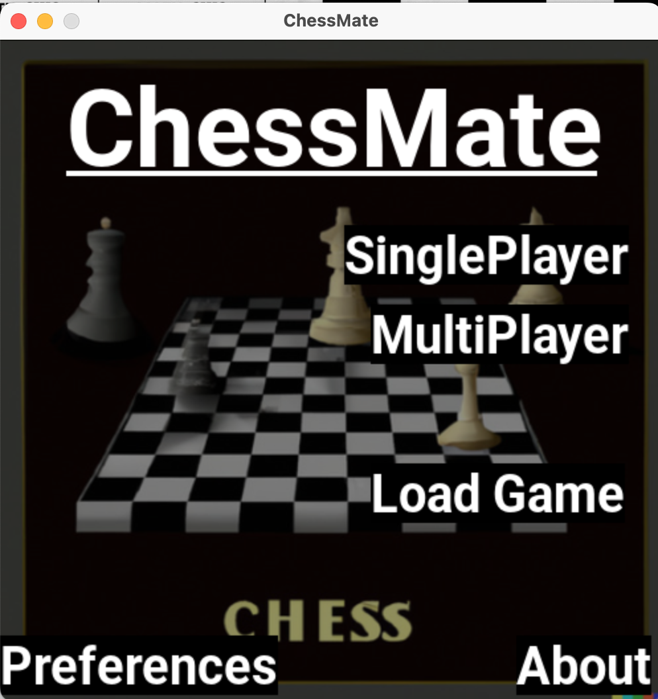

# ChessMate
This is a fully featured chess app written purely in Python using Pygame Library. I 
have used the minimax algorithm with alpha-beta pruning for move generation and evaluation.

## Running the Project
- Make sure you have Python and pygame installed and working.
- Download zip file and extract it
- Then, run the main.py file. 
- If pygame is not installed run:  pip install pygame

## Features
- Clean GUI with a lot of menus for ease of use.
- Allows users to make only valid move, does not allow users to make moves that puts the user's king at check.
- Detects check, checkmate, stalemate and informs user.
- Supports things like castling, pawn promotion, enpassent etc.
- Supports saving and loading games.
- Has a single player mode to play against a moderate difficulty AI
- Has a chess game timer.
- Has a preference menu where you can customize the app to meet your preferences.
- Has a chess about menu to make things easy for users.

## Video Demo
- Youtube link: https://youtu.be/dCnhOOocKO8

